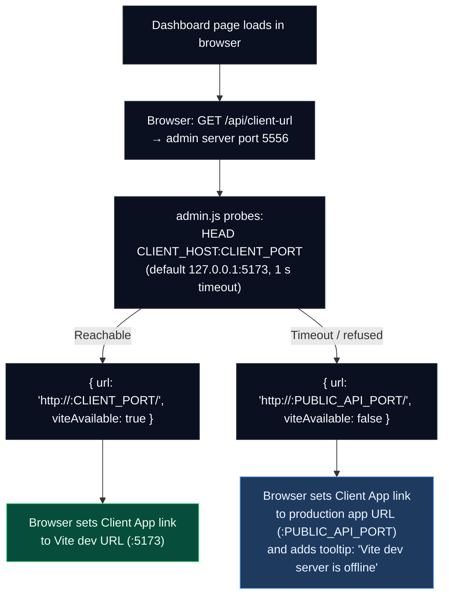
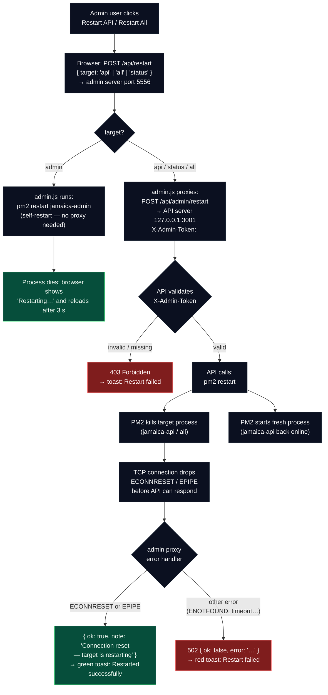
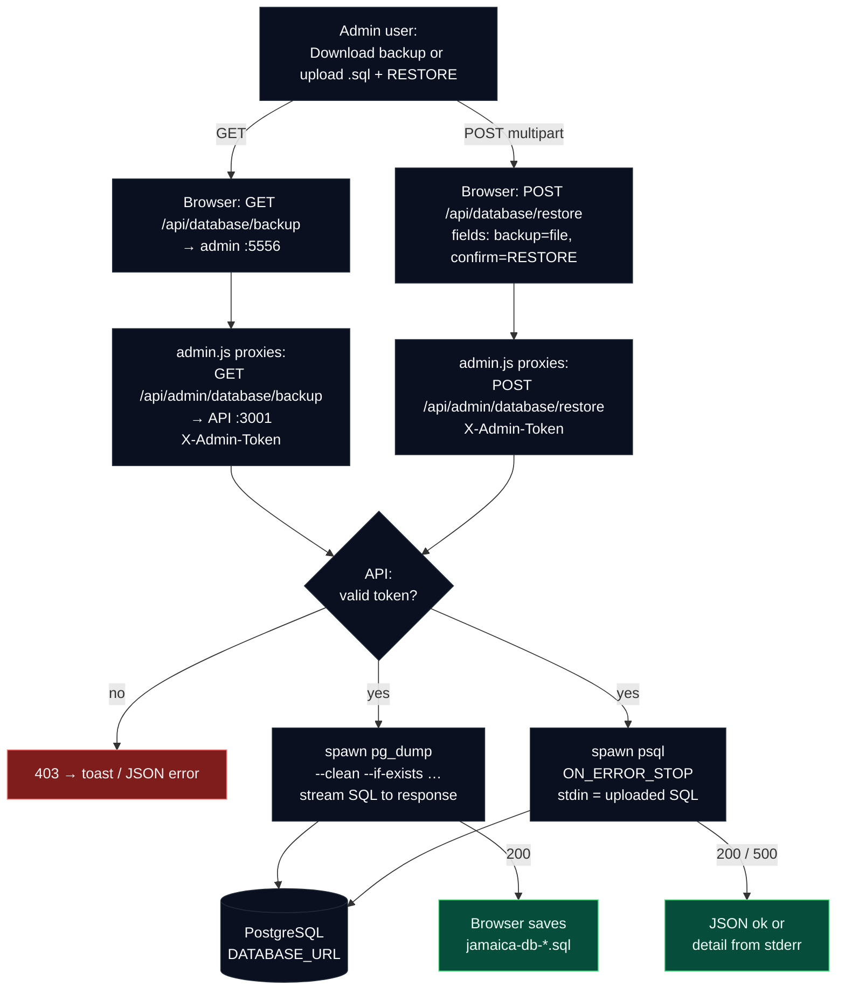
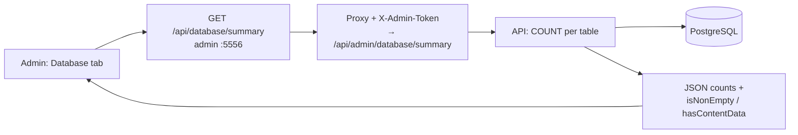
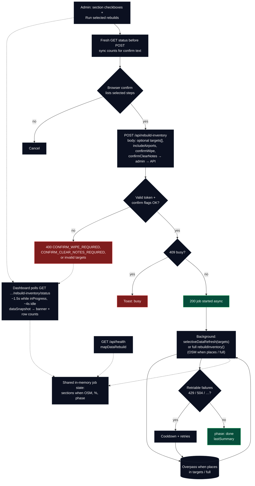

## Admin Site Diagrams

### Client App link resolution



---

### Login flow

```mermaid
flowchart TD
  U[User] --> L[Clicks \"Login\" link on map page]
  L --> A[Requests Admin site:<br/>GET /login on port 5556]

  A --> F[Submits credentials:<br/>POST /login]
  F --> R{Rate-limit / lockout check by IP}
  R -->|Locked out| C1[Set cookie:<br/>login_error=locked]
  C1 -->|Redirect| A
  A --> M[Login page shows lockout message]

  R -->|Not locked| V{Validate username + password}
  V -->|Valid| S[Set cookie:<br/>admin_token=HMAC (HttpOnly, SameSite=Strict)]
  S -->|Redirect| D[Requests dashboard:<br/>GET /]
  V -->|Invalid| F2[Record failure attempt<br/>in sliding window]
  F2 --> C2[Set cookie:<br/>login_error=invalid]
  C2 -->|Redirect| A

  D --> AM{authMiddleware checks admin_token cookie}
  AM -->|Authenticated| OK[Admin dashboard content]
  AM -->|Not authenticated| A
```


---

### Restart flow



---

### Database backup and restore



---

### Database tab — row counts (`GET /api/database/summary`)

Proxied from admin to **`GET /api/admin/database/summary`** with **`X-Admin-Token`**. Helps operators see whether tables are empty; **parishes** (14) and **features** (70) often appear immediately after a fresh Postgres volume because **`seedParishes()`** runs on API boot (see [`DATABASE-AND-MAP-DATA.md`](./DATABASE-AND-MAP-DATA.md)).



---

### Map data rebuild (selective targets or full OSM)

Poll responses and the pre-flight **GET** include **`dataSnapshot`** (`places` / `airports` / `notes` counts, **`wipeWarning`**). The UI uses **section checkboxes**; **`POST`** sends a **`targets`** array for selective refresh, or omits it for the **legacy full** rebuild (same as CLI `db:rebuild`). **`confirmWipe`** is required when **`places`** would delete rows (or counts are unknown); **`confirmClearNotes`** when **`notes_clear`** is selected. **`GET /api/health`** → **`mapDataRebuild`** omits **`dataSnapshot`**.


