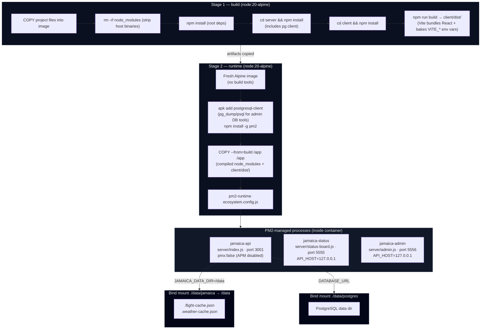
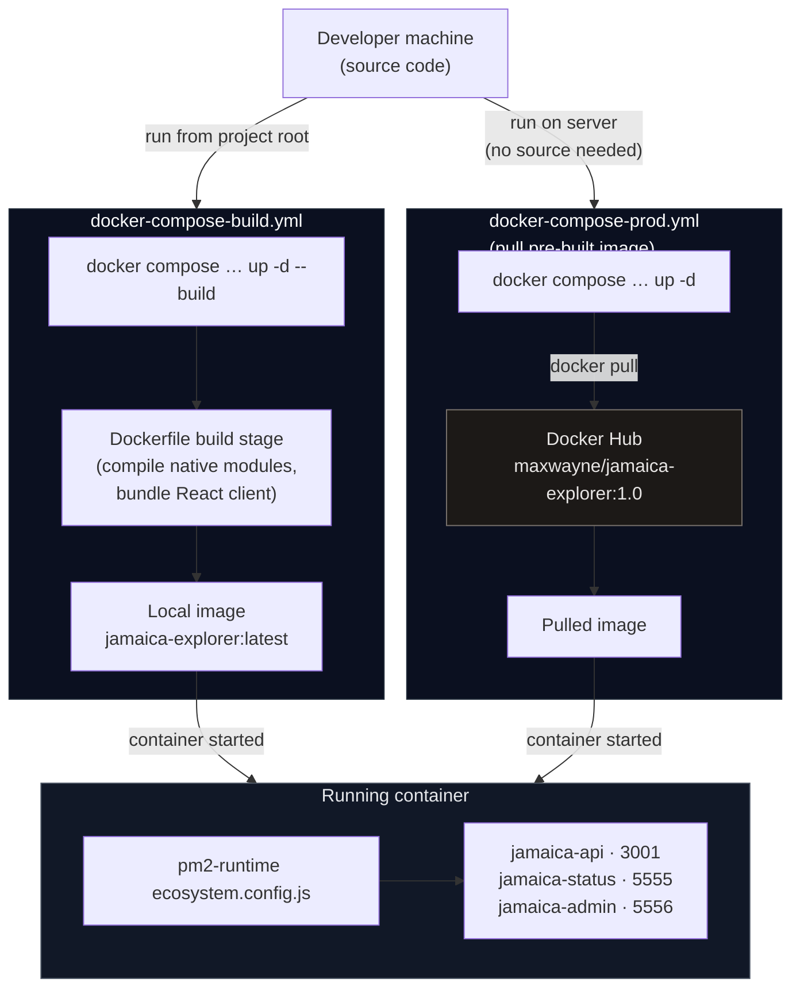
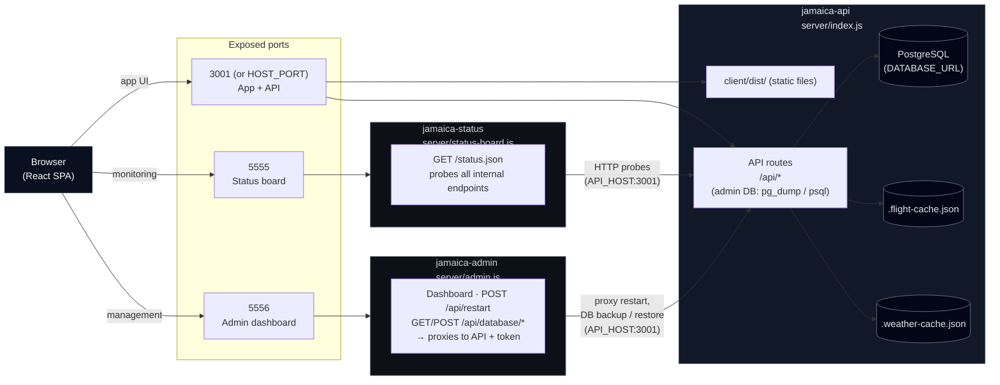
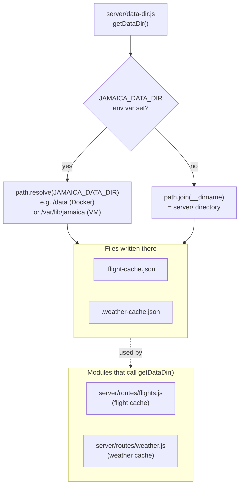
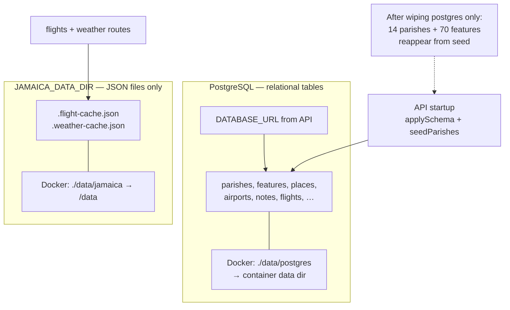

## Build Process and Startup Diagram

The diagrams below show how the application is built in each mode and how the three server processes relate to each other at runtime.

---

### Docker multi-stage build

---

### Docker Compose deployment paths

---

### Runtime architecture (all modes)

---

### Data directory (`JAMAICA_DATA_DIR`)

---

### Two persistence layers (PostgreSQL vs `JAMAICA_DATA_DIR`)

Use this when debugging “I deleted data but the DB still has rows” or “counts came back after restart”.

---
