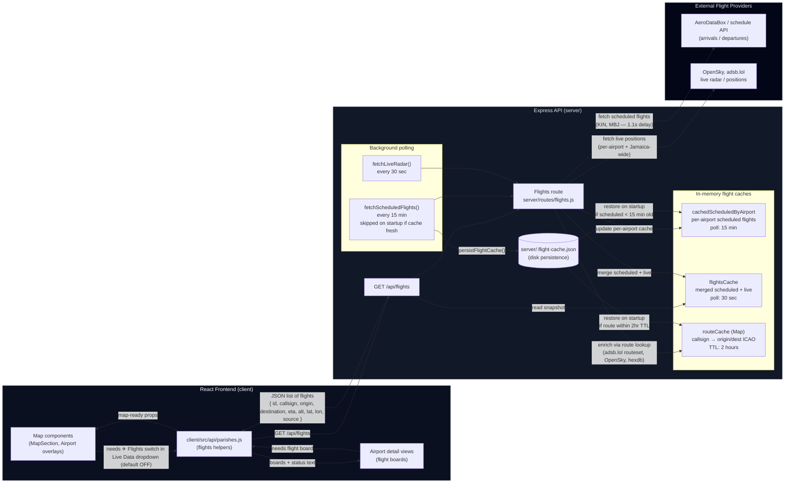

## Flight Data Flow Diagram

The diagram below shows how scheduled and live flight data is collected from external providers, cached in the backend, and used in the frontend map and airport views.

