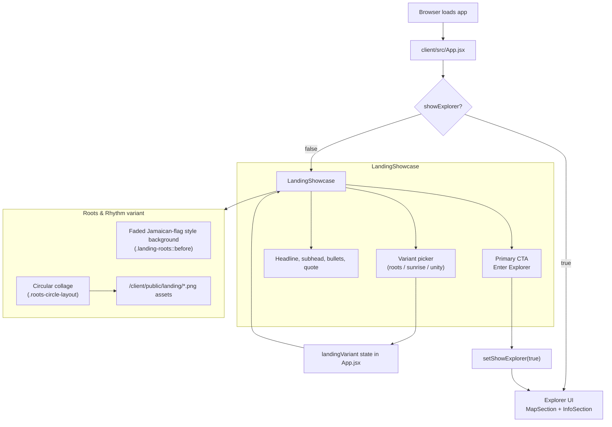

## Landing Page Diagram

```mermaid
flowchart TD
  A["Browser loads app"] --> B["client/src/App.jsx"]
  B --> C{"showExplorer?"}

  C -->|"false"| D["LandingShowcase"]
  C -->|"true"| E["Explorer UI\nMapSection + InfoSection"]

  subgraph Landing["LandingShowcase"]
    D1["Variant picker\n(roots / sunrise / unity)"]
    D2["Headline, subhead, bullets, quote"]
    D3["Primary CTA\nEnter Explorer"]
    D --> D1
    D --> D2
    D --> D3
  end

  D1 --> F["landingVariant state in App.jsx"]
  F --> D
  D3 --> G["setShowExplorer(true)"]
  G --> E

  subgraph Roots["Roots & Rhythm variant"]
    R1["Faded Jamaican-flag style background\n(.landing-roots::before)"]
    R2["Circular collage\n(.roots-circle-layout)"]
    R3["/client/public/landing/*.png assets"]
    R2 --> R3
  end

  D --> Roots
```
