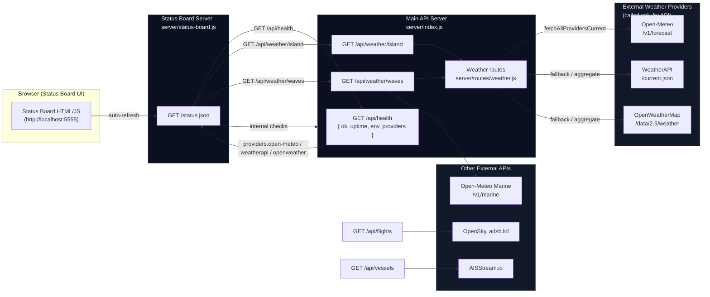

## Status Board Architecture Diagram

The diagram below shows how the status board queries internal services and how weather provider health is surfaced without calling external weather APIs directly from the board.

