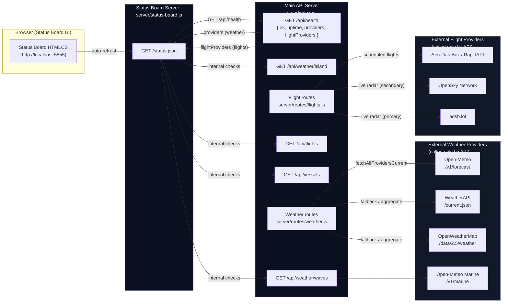

## Status Board Architecture Diagram

The diagram below shows how the status board queries internal services and derives all external provider health from the main API's `/api/health` endpoint — it makes **no direct calls** to external weather or flight APIs.

