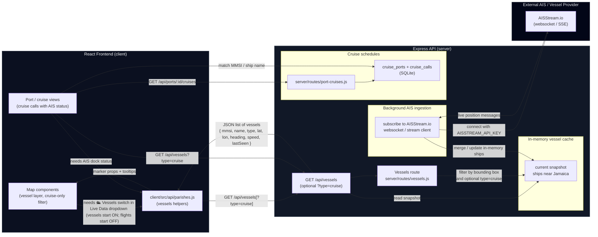

## Vessel Data Flow Diagram

The diagram below shows how AIS/vessel data is streamed from external providers, processed in the backend, and displayed on the Jamaica map and port views.

```mermaid
flowchart LR
  %% Frontend
  subgraph Frontend["React Frontend (client)"]
    Map["Map components<br/>(vessel layer, cruise-only filter)"]
    PortViews["Port / cruise views<br/>(cruise calls with AIS status)"]
    VesselsApiClient["client/src/api/parishes.js<br/>(vessels helpers)"]
  end

  %% Backend
  subgraph Backend["Express API (server)"]
    VesselsRoute["Vessels route<br/>server/routes/vessels.js"]
    VesselsEndpoint["GET /api/vessels<br/>(optional ?type=cruise)"]

    subgraph VesselCache["In-memory vessel cache"]
      VesselSnapshot["current snapshot<br/>ships near Jamaica"]
    end

    subgraph VesselJobs["Background AIS ingestion"]
      StreamTask["subscribe to AISStream.io<br/>websocket / stream client"]
    end

    subgraph CruiseData["Cruise schedules"]
      CruiseTables["cruise_ports + cruise_calls<br/>(SQLite)"]
      PortCruiseRoute["server/routes/port-cruises.js"]
    end
  end

  %% External providers
  subgraph VesselProviders["External AIS / Vessel Provider"]
    AIS["AISStream.io<br/>(websocket / SSE)"]
  end

  %% Frontend calls backend
  Map -->|"needs 🛳 Vessels switch in Live Data dropdown (vessels start ON; flights start OFF)"| VesselsApiClient
  PortViews -->|"needs AIS dock status"| VesselsApiClient
  VesselsApiClient -->|"GET /api/vessels[?type=cruise]"| VesselsEndpoint

  %% Endpoint uses cache + filters
  VesselsEndpoint -->|"read snapshot"| VesselSnapshot
  VesselsEndpoint --> VesselsRoute
  VesselsRoute -->|"filter by bounding box<br/>and optional type=cruise"| VesselSnapshot

  %% AIS ingestion populates snapshot
  StreamTask -->|"connect with AISSTREAM_API_KEY"| AIS
  AIS -->|"live position messages"| StreamTask
  StreamTask -->|"merge / update in-memory ships"| VesselSnapshot

  %% Cruise schedule correlation (port popup)
  PortCruiseRoute --> CruiseTables
  PortViews -->|"GET /api/ports/:id/cruises"| PortCruiseRoute
  PortViews -->|"GET /api/vessels?type=cruise"| VesselsEndpoint
  PortViews -->|"match MMSI / ship name"| CruiseTables

  %% Data back to frontend
  VesselsEndpoint -->|"JSON list of vessels<br/>{ mmsi, name, type, lat, lon, heading, speed, lastSeen }"| VesselsApiClient
  VesselsApiClient -->|"marker props + tooltips"| Map

  %% Legend
  classDef frontend fill:#0b1020,stroke:#1f2937,color:#f9fafb;
  classDef backend fill:#111827,stroke:#4b5563,color:#e5e7eb;
  classDef external fill:#020617,stroke:#4b5563,color:#e5e7eb;

  class Frontend frontend;
  class Backend backend;
  class VesselProviders external;
```

