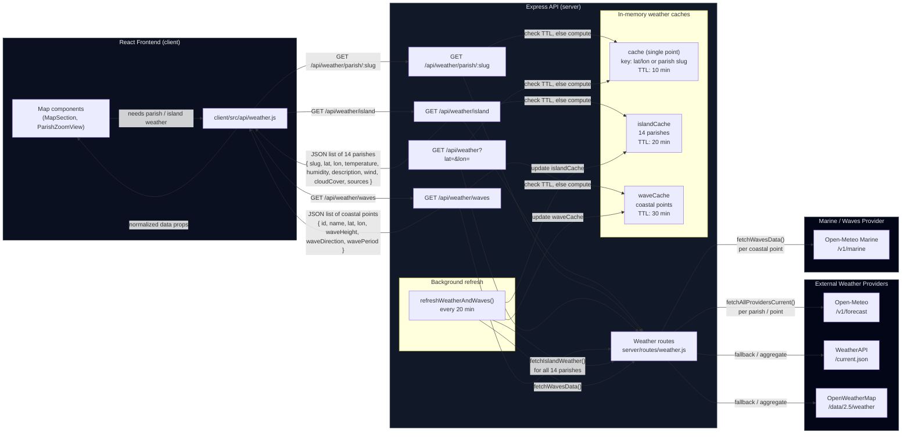

## Weather and Wave Data Flow Diagram

The diagram below shows how weather and marine wave data is collected from external providers, cached in the backend, and then presented on the Jamaica map in the frontend.

